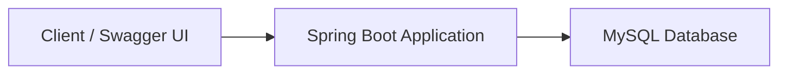

# Expense Tracker API

A RESTful Expense Tracker application built with **Spring Boot**. It allows users to securely manage their expenses using JWT authentication. The project is containerized using Docker for easy setup and deployment.

## Tech Stack

* Java 17
* Spring Boot
* Spring Security (JWT)
* Spring Data JPA
* MySQL
* Maven
* Swagger UI
* Docker & Docker Compose

## Architecture



## Project Structure

```text
├── src/
├── Dockerfile
├── docker-compose.yml
├── pom.xml
└── README.md
```

## Running the Project

### Without Docker

```bash
mvn spring-boot:run
```

### With Docker

```bash
docker compose up --build
```

## API Documentation

After starting the application, open:

```
http://localhost:8080/swagger-ui/index.html
```

## Features

* User Authentication (JWT)
* CRUD Operations for Expenses
* Secure REST APIs
* Dashboard for monthly and annual reports
* Swagger API Documentation
* Dockerized Application

## Deployment

* Deployed on AWS EC2
* Can be accessed using http://15.134.216.24:8080/swagger-ui/index.html
